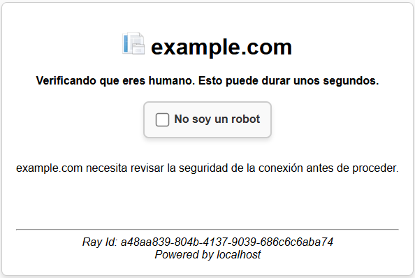
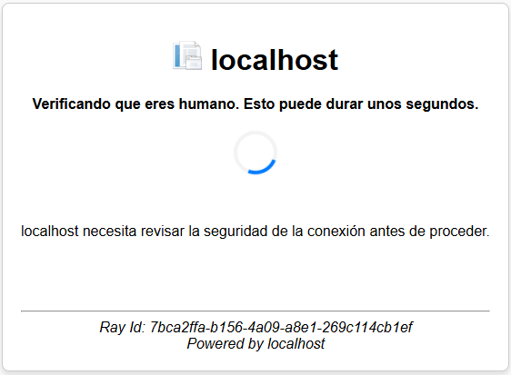
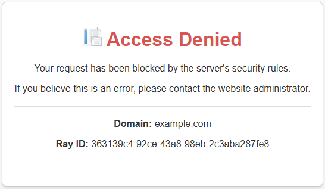
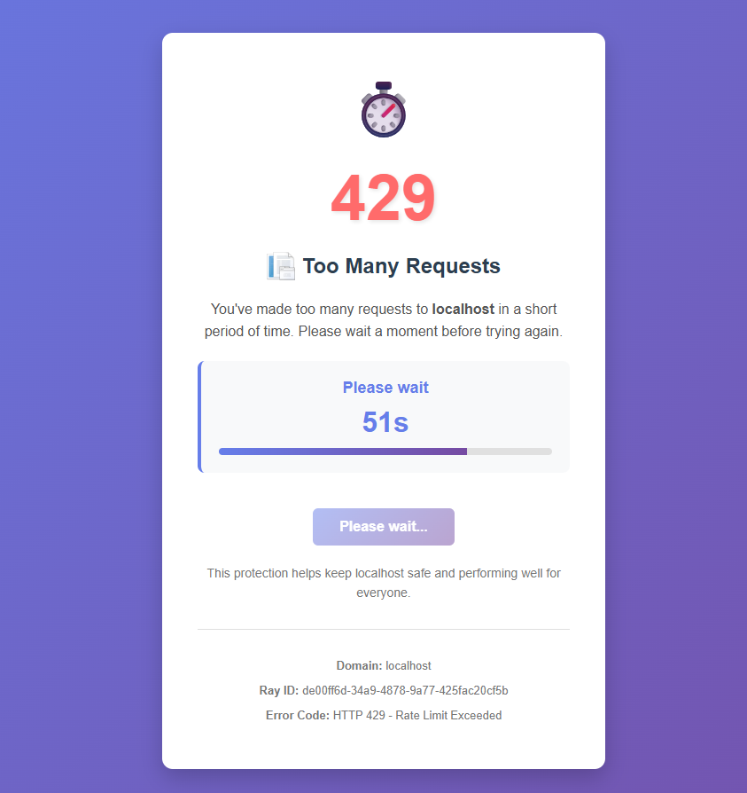

[](https://dev.azure.com/kacosta/IISFrontGuard/_apis/build/status%2FIISFrontGuard?branchName=master)
[](https://www.nuget.org/packages/IISFrontGuard.Module/)
[](https://sonarcloud.io/summary/new_code?id=DeuxaX5M07WEtzjf4tc72Y3QSk2lqykrX3g123xwb9GKXkG7IYLuJQQJ99BLACAAAAAAAAAAAAASAZDO1MN9)

 # IISFrontGuard

 [](https://sonarcloud.io/summary/new_code?id=DeuxaX5M07WEtzjf4tc72Y3QSk2lqykrX3g123xwb9GKXkG7IYLuJQQJ99BLACAAAAAAAAAAAAASAZDO1MN9)

> **Disclaimer:** IISFrontGuard is a project name, not affiliated with Cloudflare or Microsoft Corp.

[](https://sonarcloud.io/summary/new_code?id=DeuxaX5M07WEtzjf4tc72Y3QSk2lqykrX3g123xwb9GKXkG7IYLuJQQJ99BLACAAAAAAAAAAAAASAZDO1MN9)

IISFrontGuard is a Web Application Firewall (WAF) module for Internet Information Services (IIS) built on .NET Framework 4.8. It provides advanced security features including request filtering, rate limiting, managed/interactive challenges, and comprehensive logging with webhook notifications.

## Features

- 🛡️ **Web Application Firewall (WAF)** with customizable rules and conditions
- 🚦 **Rate Limiting** to prevent abuse and DDoS attacks
- 🔐 **Challenge Pages** (Managed and Interactive) for bot detection
- 📊 **Request/Response Logging** with SQL Server backend
- 🔔 **Webhook Notifications** for security events
- 🎯 **IP-based Filtering** with CIDR range support
- 🔍 **Multiple Condition Operators** (regex, contains, equals, IP ranges, etc.)
- 🌐 **Multi-App Support** with per-host configuration
- 🔒 **Security Headers** automatic injection
- 🍪 **Token-based Authentication** with client fingerprinting

## Table of Contents

- [Prerequisites](#prerequisites)
- [Database Setup](#database-setup)
- [Installation Methods](#installation-methods)
  - [Method 1: Web Application Level (Recommended for Testing)](#method-1-web-application-level-recommended-for-testing)
  - [Method 2: Global IIS Level (Server-Wide Protection)](#method-2-global-iis-level-server-wide-protection)
- [Configuration](#configuration)
- [WAF Rules Configuration](#waf-rules-configuration)
- [Webhook Configuration](#webhook-configuration)
- [Troubleshooting](#troubleshooting)
- [Uninstallation](#uninstallation)

---

## Prerequisites

- Windows Server 2012 R2 or later (or Windows 10/11 with IIS enabled)
- IIS 8.5 or later
- .NET Framework 4.8 installed
- SQL Server 2012 or later (Express, Standard, or Enterprise)
- Administrator access to the server
- Application Pool running in **Integrated Pipeline Mode**

---

## Database Setup

Before installing the module, you must create the database and its schema.

### Step 1: Create Database

1. Open **SQL Server Management Studio (SSMS)**
2. Connect to your SQL Server instance
3. Locate the SQL script at: `IISFrontGuard.Module\Scripts\init.sql`
4. Execute the script to create:
   - `IISFrontGuard` database
   - All required tables (AppEntity, WafRuleEntity, WafConditionEntity, RequestContext, ResponseContext, etc.)
   - Stored procedures
   - Default data (Actions, Fields, Operators)

### Step 2: Verify Database Creation

```sql
USE IISFrontGuard;
SELECT * FROM Action;
SELECT * FROM Field;
SELECT * FROM Operator;
```

You should see pre-populated data for Actions (Skip, Block, Managed Challenge, Interactive Challenge, Log), Fields (cookie, hostname, ip, etc.), and Operators (equals, contains, regex, etc.).

### Step 3: Create Your First Application Entry

```sql
USE IISFrontGuard;
GO

INSERT INTO AppEntity (AppName, AppDescription, Host, TokenExpirationDurationHr)
VALUES ('My Web App', 'Production Web Application', 'example.com', 12);
GO
```

Replace `'example.com'` with your actual hostname.

---

## Installation Methods

### Method 1: Web Application Level (Recommended for Testing)

This method installs the module only for a specific web application. Ideal for testing or when you want to protect only certain applications.

#### Step 1: Build the Module

1. Open the solution in **Visual Studio 2019** or later
2. Set the build configuration to **Release**
3. Build the `IISFrontGuard.Module` project
4. The compiled DLL will be in: `IISFrontGuard.Module\bin\Release\IISFrontGuard.Module.dll`

#### Step 2: Copy Module DLL to Your Web Application

Copy `IISFrontGuard.Module.dll` to your web application's `bin` folder:

```
C:\inetpub\wwwroot\YourWebApp\bin\IISFrontGuard.Module.dll
```

#### Step 3: Configure Web.config

Add the module registration and configuration to your application's `Web.config`:

```xml
<?xml version="1.0" encoding="utf-8"?>
<configuration>
  <!-- Connection Strings -->
  <connectionStrings>
    <add name="IISFrontGuard"
         connectionString="Data Source=.;Initial Catalog=IISFrontGuard;Integrated Security=True;TrustServerCertificate=True;Min Pool Size=5;Max Pool Size=100;Connection Timeout=5;" />
  </connectionStrings>

  <!-- App Settings -->
  <appSettings>
    <!-- Database Configuration -->
    <add key="GlobalLogger.DefaultConnectionStringName" value="IISFrontGuard" />
    <add key="GlobalRequestEncryptionKey" value="YOUR_16_CHAR_KEY" />
    
    <!-- Rate Limiting Configuration -->
    <add key="RateLimitMaxRequestsPerMinute" value="150" />
    <add key="RateLimitWindowSeconds" value="60" />

    <!-- Trusted Proxy IPs (for X-Forwarded-For header validation) -->
    <add key="TrustedProxyIPs" value="" />

    <!-- Webhook Configuration (Optional) -->
    <add key="Webhook.Enabled" value="false" />
    <add key="Webhook.Url" value="" />
    <add key="Webhook.AuthHeader" value="" />
    <add key="Webhook.CustomHeaders" value="" />
    <add key="Webhook.FailureLogPath" value="C:\Logs\webhook-failures.log" />
  </appSettings>

  <!-- System.webServer Configuration -->
  <system.webServer>
    <validation validateIntegratedModeConfiguration="false"/>
    <modules>
      <!-- Register IISFrontGuard Module -->
      <add name="FrontGuardModule" 
           type="IISFrontGuard.Module.FrontGuardModule, IISFrontGuard.Module, Version=1.0.0.0, Culture=neutral" 
           preCondition="managedHandler,runtimeVersionv4.0" />
    </modules>
  </system.webServer>

  <system.web>
    <compilation debug="false" targetFramework="4.8" />
    <httpRuntime targetFramework="4.8" />
  </system.web>
</configuration>
```

**Important Configuration Notes:**
- Replace `YOUR_16_CHAR_KEY` with a random 16-character encryption key
- Update the connection string to match your SQL Server instance
- Set `RateLimitMaxRequestsPerMinute` and `RateLimitWindowSeconds` based on your needs

#### Step 4: Restart Application Pool

1. Open **IIS Manager**
2. Navigate to **Application Pools**
3. Find your application pool
4. Right-click and select **Recycle** or **Stop** then **Start**

#### Step 5: Test the Installation

1. Browse to your web application
2. Check the SQL Server database - you should see entries in the `RequestContext` table
3. Test rate limiting by making rapid requests (you should hit the 429 page after exceeding the limit)

---

### Method 2: Global IIS Level (Server-Wide Protection)

This method installs the module globally in IIS, protecting all websites and applications on the server (unless explicitly excluded).

#### Step 1: Build and Register the Module in GAC (Optional but Recommended)

For global installation, it's recommended to register the assembly in the Global Assembly Cache (GAC).

1. Build the module in **Release** mode
2. Sign the assembly with a strong name key:
   - Right-click `IISFrontGuard.Module` project → **Properties**
   - Go to **Signing** tab
   - Check **"Sign the assembly"**
   - Create a new strong name key file
   - Rebuild the project

3. Install to GAC using `gacutil`:

```cmd
cd "C:\Program Files (x86)\Microsoft SDKs\Windows\v10.0A\bin\NETFX 4.8 Tools"
gacutil /i "C:\path\to\IISFrontGuard.Module.dll"
```

Or use PowerShell:

```powershell
[System.Reflection.Assembly]::Load("System.EnterpriseServices, Version=4.0.0.0, Culture=neutral, PublicKeyToken=b03f5f7f11d50a3a")
$publish = New-Object System.EnterpriseServices.Internal.Publish
$publish.GacInstall("C:\path\to\IISFrontGuard.Module.dll")
```

#### Step 2: Copy DLL to a Shared Location (Alternative to GAC)

If you don't use GAC, copy the DLL to a shared location accessible by all applications:

```
C:\Program Files\IISFrontGuard\IISFrontGuard.Module.dll
```

Create the directory if it doesn't exist:

```cmd
mkdir "C:\Program Files\IISFrontGuard"
copy "C:\path\to\IISFrontGuard.Module.dll" "C:\Program Files\IISFrontGuard\"
```

#### Step 3: Register Module in applicationHost.config

1. Open `applicationHost.config` (requires administrator privileges):

```
C:\Windows\System32\inetsrv\config\applicationHost.config
```

2. **Method A: Using IIS Manager UI**

   a. Open **IIS Manager** as Administrator
   
   b. Select the server node (root level)
   
   c. Double-click **Modules**
   
   d. Click **Configure Native Modules** in the right panel (if using native), or use **Add Managed Module** for managed modules
   
   e. Click **Register** (for managed modules) or **Add Managed Module**
   
   f. Enter:
      - **Name**: `FrontGuardModule`
      - **Type**: `IISFrontGuard.Module.FrontGuardModule, IISFrontGuard.Module, Version=1.0.0.0, Culture=neutral, PublicKeyToken=175d06f243437f3c`
   
   g. Click **OK**

3. **Method B: Manual Configuration File Edit**

   a. Back up `applicationHost.config`:

   ```cmd
   copy C:\Windows\System32\inetsrv\config\applicationHost.config C:\Windows\System32\inetsrv\config\applicationHost.config.backup
   ```

   b. Open `applicationHost.config` in a text editor (as Administrator)

   c. Locate the `<system.webServer>` section and find `<globalModules>` tag

   d. Add the following inside `<globalModules>` (if using a native wrapper) or in `<modules>` for managed:

   For **managed module**, add to `<system.webServer><modules>` section:

   ```xml
   <system.webServer>
     <modules>
       <!-- Add this line -->
       <add name="FrontGuardModule" 
            type="IISFrontGuard.Module.FrontGuardModule, IISFrontGuard.Module, Version=1.0.0.0, Culture=neutral, PublicKeyToken=175d06f243437f3c" 
            preCondition="managedHandler,runtimeVersionv4.0" />
     </modules>
   </system.webServer>
   ```

   **Note:** Replace `175d06f243437f3c` with your assembly's public key token if you signed it. If not signed, omit the `PublicKeyToken` parameter:

   ```xml
   <add name="FrontGuardModule" 
        type="IISFrontGuard.Module.FrontGuardModule, IISFrontGuard.Module, Version=1.0.0.0, Culture=neutral" 
        preCondition="managedHandler,runtimeVersionv4.0" />
   ```

#### Step 4: Configure Global Settings

You have two options for global configuration:

**Option A: Use applicationHost.config**

Add configuration directly to `applicationHost.config`:

```xml
<configuration>
  <appSettings>
    <add key="GlobalLogger.DefaultConnectionStringName" value="IISFrontGuard" />
    <add key="GlobalRequestEncryptionKey" value="YOUR_16_CHAR_KEY" />
    <add key="RateLimitMaxRequestsPerMinute" value="150" />
    <add key="RateLimitWindowSeconds" value="60" />
    <add key="Webhook.Enabled" value="false" />
  </appSettings>
  
  <connectionStrings>
    <add name="IISFrontGuard"
         connectionString="Data Source=.;Initial Catalog=IISFrontGuard;Integrated Security=True;TrustServerCertificate=True;Min Pool Size=5;Max Pool Size=100;Connection Timeout=5;" />
  </connectionStrings>
</configuration>
```

**Option B: Per-Application Configuration Override**

Each application can override global settings in its own `Web.config`.

#### Step 5: Configure Per-Host Database Connections (Optional)

For multi-tenant scenarios, you can configure different databases per hostname:

```xml
<appSettings>
  <!-- Default connection -->
  <add key="GlobalLogger.DefaultConnectionStringName" value="IISFrontGuard" />
  
  <!-- Per-host connection string names or connection strings -->
  <add key="GlobalLogger.Host.www.site1.com" value="Site1DB" />
  <add key="GlobalLogger.Host.www.site2.com" value="Data Source=.;Initial Catalog=Site2_IISFrontGuard;Integrated Security=True;" />
</appSettings>

<connectionStrings>
  <add name="IISFrontGuard" connectionString="..." />
  <add name="Site1DB" connectionString="..." />
</connectionStrings>
```

#### Step 6: Restart IIS

After modifying `applicationHost.config`, restart IIS:

```cmd
iisreset
```

Or use PowerShell:

```powershell
Restart-Service W3SVC -Force
```

#### Step 7: Verify Installation

1. Open **IIS Manager**
2. Select your server or a specific site
3. Double-click **Modules**
4. Verify that **FrontGuardModule** appears in the list

5. Browse to any website on the server
6. Check the `RequestContext` table in SQL Server - you should see logged requests

---

## Configuration

### Connection String Configuration

The module supports multiple connection string resolution strategies:

1. **Per-Host Connection String**: `GlobalLogger.Host.{hostname}`
2. **Default Connection String Name**: `GlobalLogger.DefaultConnectionStringName`
3. **Fallback Connection String**: Hard-coded in the module (not recommended for production)

Example:

```xml
<connectionStrings>
  <add name="IISFrontGuard"
       connectionString="Data Source=SQLSERVER01;Initial Catalog=IISFrontGuard;User Id=waf_user;Password=SecurePassword123;TrustServerCertificate=True;Min Pool Size=5;Max Pool Size=100;Connection Timeout=5;" />
</connectionStrings>

<appSettings>
  <add key="GlobalLogger.DefaultConnectionStringName" value="IISFrontGuard" />
</appSettings>
```

### Encryption Key Configuration

The `GlobalRequestEncryptionKey` must be exactly 16 characters for AES encryption:

```xml
<add key="GlobalRequestEncryptionKey" value="6943825701284396" />
```

Generate a secure key:

```powershell
# PowerShell script to generate a 16-character key
$chars = (48..57) + (65..90) + (97..122)
-join (1..16 | ForEach-Object { [char]($chars | Get-Random) })
```

### Rate Limiting Configuration

Configure rate limiting to prevent abuse:

```xml
<add key="RateLimitMaxRequestsPerMinute" value="150" />
<add key="RateLimitWindowSeconds" value="60" />
```

- `RateLimitMaxRequestsPerMinute`: Maximum number of requests allowed per IP
- `RateLimitWindowSeconds`: Time window in seconds for rate limit calculation

### Trusted Proxy Configuration

If your application is behind a load balancer or reverse proxy (e.g., nginx, CloudFlare), configure trusted proxy IPs:

```xml
<add key="TrustedProxyIPs" value="10.0.0.1,10.0.0.2,172.16.0.1" />
```

This allows the module to trust the `X-Forwarded-For` header from these IPs to determine the real client IP.

---

## WAF Rules Configuration

WAF rules are configured in the SQL Server database. Here's how to create rules:

### Creating an Application

```sql
INSERT INTO AppEntity (AppName, AppDescription, Host, TokenExpirationDurationHr)
VALUES ('Production Site', 'Main production website', 'example.com', 12);
```

### Creating a WAF Rule

```sql
-- Block requests from specific IP
DECLARE @AppId UNIQUEIDENTIFIER = (SELECT Id FROM AppEntity WHERE Host = 'example.com');

INSERT INTO WafRuleEntity (Nombre, ActionId, AppId, Prioridad, Habilitado)
VALUES ('Block Malicious IP', 2, @AppId, 10, 1);

DECLARE @RuleId INT = SCOPE_IDENTITY();

-- Add condition: IP equals specific value
INSERT INTO WafConditionEntity (FieldId, OperatorId, Valor, LogicOperator, WafRuleEntityId, ConditionOrder)
VALUES (3, 1, '192.168.1.100', 1, @RuleId, 1);
```

### Available Actions

| ActionId | Name | Description |
|----------|------|-------------|
| 1 | Skip | Allow request and skip further processing |
| 2 | Block | Block the request with 403 page |
| 3 | Managed Challenge | Automatic challenge (JavaScript verification) |
| 4 | Interactive Challenge | User interaction required (checkbox) |
| 5 | Log | Log request without enforcement |

### Example Rules

**Block SQL Injection Attempts:**

```sql
DECLARE @AppId UNIQUEIDENTIFIER = (SELECT Id FROM AppEntity WHERE Host = 'example.com');

INSERT INTO WafRuleEntity (Nombre, ActionId, AppId, Prioridad, Habilitado)
VALUES ('Block SQL Injection', 2, @AppId, 5, 1);

DECLARE @RuleId INT = SCOPE_IDENTITY();

INSERT INTO WafConditionEntity (FieldId, OperatorId, Valor, LogicOperator, WafRuleEntityId, ConditionOrder)
VALUES (15, 5, '.*(union|select|insert|update|delete|drop|exec).*', 1, @RuleId, 1);
```

**Challenge Suspicious User Agents:**

```sql
DECLARE @AppId UNIQUEIDENTIFIER = (SELECT Id FROM AppEntity WHERE Host = 'example.com');

INSERT INTO WafRuleEntity (Nombre, ActionId, AppId, Prioridad, Habilitado)
VALUES ('Challenge Bots', 4, @AppId, 50, 1);

DECLARE @RuleId INT = SCOPE_IDENTITY();

INSERT INTO WafConditionEntity (FieldId, OperatorId, Valor, LogicOperator, WafRuleEntityId, ConditionOrder)
VALUES (9, 5, '.*(bot|crawler|spider|scraper).*', 1, @RuleId, 1);
```

**Block Specific Countries (requires GeoIP):**

```sql
-- GeoIP functionality is implemented using MaxMind GeoLite2 database
-- Place GeoLite2-Country.mmdb in the application root directory
-- Example: Block requests from specific countries by ISO2 code

INSERT INTO WafRuleEntity (Nombre, ActionId, AppId, Prioridad, Habilitado)
VALUES ('Block Specific Countries', 2, @AppId, 50, 1);

DECLARE @RuleId INT = SCOPE_IDENTITY();

-- Block multiple countries (comma-separated ISO2 codes)
INSERT INTO WafConditionEntity (FieldId, OperatorId, Valor, LogicOperator, WafRuleEntityId, ConditionOrder)
VALUES (21, 11, 'cn,ru,kp', 1, @RuleId, 1); -- Block China, Russia, North Korea
```

---

## Webhook Configuration

IISFrontGuard can send real-time security event notifications to external webhooks.

### Enable Webhooks

```xml
<add key="Webhook.Enabled" value="true" />
<add key="Webhook.Url" value="https://your-endpoint.com/api/webhooks/security" />
```

### Multiple Webhook URLs

Separate multiple URLs with semicolon or comma:

```xml
<add key="Webhook.Url" value="https://webhook1.com/api;https://webhook2.com/api" />
```

### Authentication

Add an authorization header:

```xml
<add key="Webhook.AuthHeader" value="Bearer YOUR_SECRET_TOKEN" />
```

### Custom Headers

Add custom headers (format: `HeaderName:HeaderValue;AnotherHeader:Value`):

```xml
<add key="Webhook.CustomHeaders" value="X-API-Key:your-api-key;X-Tenant-ID:tenant123" />
```

### Failure Logging

Configure a path to log webhook delivery failures:

```xml
<add key="Webhook.FailureLogPath" value="C:\Logs\IISFrontGuard\webhook-failures.log" />
```

### Webhook Payload Example

```json
{
  "eventType": "RequestBlocked",
  "severity": "High",
  "timestamp": "2025-01-15T10:30:45.123Z",
  "rayId": "a1b2c3d4-e5f6-7890-abcd-ef1234567890",
  "clientIp": "203.0.113.45",
  "hostName": "example.com",
  "userAgent": "Mozilla/5.0...",
  "url": "https://example.com/admin/login",
  "httpMethod": "POST",
  "ruleId": 42,
  "ruleName": "Block Admin Access from Untrusted IPs",
  "description": "Request blocked by WAF rule: Block Admin Access from Untrusted IPs",
  "additionalData": {
    "rule_priority": 10,
    "conditions": 2
  }
}
```

### Security Event Types

- `RequestBlocked` - Request blocked by WAF rule
- `RateLimitExceeded` - Client exceeded rate limit
- `ChallengeIssued` - Challenge page issued
- `ChallengePassed` - Challenge successfully completed
- `ChallengeFailed` - Challenge failed
- `CSRFTokenMismatch` - CSRF validation failed
- `TokenReplayAttempt` - Token fingerprint mismatch detected
- `MultipleChallengeFails` - Multiple challenge failures from same IP

---

## Troubleshooting

### Module Not Loading

**Symptoms:** WAF rules not being applied, no logs in database

**Solutions:**
1. Verify the DLL is in the correct location (`bin` folder for app-level, GAC or shared folder for global)
2. Check Application Pool is running in **Integrated Mode**
3. Verify .NET Framework 4.8 is installed
4. Check Event Viewer → Windows Logs → Application for errors
5. Ensure `Web.config` or `applicationHost.config` has correct module registration

```cmd
# Verify .NET Framework 4.8 is installed
reg query "HKEY_LOCAL_MACHINE\SOFTWARE\Microsoft\NET Framework Setup\NDP\v4\Full" /v Release
```

### Database Connection Errors

**Symptoms:** Module loads but no data in RequestContext table, HTTP 500 errors

**Solutions:**
1. Verify connection string is correct
2. Test SQL Server connectivity from the IIS server:

```cmd
sqlcmd -S YOUR_SQL_SERVER -d IISFrontGuard -E
```

3. Check SQL Server allows remote connections
4. Verify Application Pool identity has access to the database:

```sql
-- Grant access to IIS Application Pool identity
USE IISFrontGuard;
CREATE USER [IIS APPPOOL\YourAppPoolName] FOR LOGIN [IIS APPPOOL\YourAppPoolName];
ALTER ROLE db_datareader ADD MEMBER [IIS APPPOOL\YourAppPoolName];
ALTER ROLE db_datawriter ADD MEMBER [IIS APPPOOL\YourAppPoolName];
GRANT EXECUTE TO [IIS APPPOOL\YourAppPoolName];
```

5. Increase connection timeout if needed:

```xml
connectionString="...;Connection Timeout=30;"
```

### Rate Limiting Not Working

**Solutions:**
1. Verify `RateLimitMaxRequestsPerMinute` and `RateLimitWindowSeconds` are configured
2. Check if the module is loaded (see "Module Not Loading" above)
3. Clear application pool cache and restart

### Challenge Pages Not Appearing

**Solutions:**
1. Verify JavaScript and cookies are enabled in the browser
2. Check WAF rules are configured correctly with ActionId 3 or 4
3. Verify encryption key is exactly 16 characters
4. Check browser console for JavaScript errors

### Webhooks Not Being Sent

**Solutions:**
1. Verify `Webhook.Enabled` is set to `true`
2. Check `Webhook.Url` is correctly configured
3. Review webhook failure log (if configured):

```cmd
type C:\Logs\IISFrontGuard\webhook-failures.log
```

4. Test webhook URL manually:

```powershell
Invoke-WebRequest -Uri "https://your-webhook-url.com" -Method POST -Body '{"test":"data"}' -ContentType "application/json"
```

### Performance Issues

**Solutions:**
1. Optimize WAF rules - reduce priority (higher number = lower priority)
2. Increase SQL Server connection pool size:

```xml
connectionString="...;Min Pool Size=10;Max Pool Size=200;"
```

3. Enable caching (WAF rules are cached for 5 minutes by default)
4. Consider reducing rate limit window or increasing allowed requests
5. Review SQL Server query performance:

```sql
-- Check RequestContext table size
SELECT COUNT(*) FROM RequestContext;

-- Archive old data
DELETE FROM RequestContext WHERE CreatedAt < DATEADD(day, -30, GETUTCDATE());
```

### Viewing Logs

**Application Event Logs:**

```cmd
eventvwr.msc
```

Navigate to: Windows Logs → Application

**IIS Logs:**

```
C:\inetpub\logs\LogFiles\
```

**SQL Server Request Logs:**

```sql
USE IISFrontGuard;

-- Recent requests
SELECT TOP 100 * FROM RequestContext ORDER BY CreatedAt DESC;

-- Blocked requests
SELECT * FROM RequestContext WHERE ActionId = 2 ORDER BY CreatedAt DESC;

```

---

## Uninstallation

### Removing from Web Application Level

1. Open your application's `Web.config`
2. Remove the module registration from `<system.webServer><modules>`:

```xml
<!-- Remove this line -->
<add name="FrontGuardModule" ... />
```

3. Delete `IISFrontGuard.Module.dll` from the `bin` folder
4. Restart the Application Pool

### Removing from Global IIS Level

1. **Using IIS Manager:**
   - Open IIS Manager as Administrator
   - Select the server node
   - Double-click **Modules**
   - Find **FrontGuardModule**
   - Right-click and select **Remove**
   - Confirm removal

2. **Manual Configuration Edit:**
   - Open `applicationHost.config` as Administrator
   - Remove the module entry from `<system.webServer><modules>`
   - Save the file

3. **Remove from GAC (if installed):**

```cmd
cd "C:\Program Files (x86)\Microsoft SDKs\Windows\v10.0A\bin\NETFX 4.8 Tools"
gacutil /u "IISFrontGuard.Module"
```

Or using PowerShell:

```powershell
[System.Reflection.Assembly]::Load("System.EnterpriseServices, Version=4.0.0.0, Culture=neutral, PublicKeyToken=b03f5f7f11d50a3a")
$publish = New-Object System.EnterpriseServices.Internal.Publish
$publish.GacRemove("C:\path\to\IISFrontGuard.Module.dll")
```

4. Delete the DLL from shared location (if used):

```cmd
del "C:\Program Files\IISFrontGuard\IISFrontGuard.Module.dll"
```

5. Restart IIS:

```cmd
iisreset
```

### Removing Database (Optional)

```sql
USE master;
GO
DROP DATABASE IISFrontGuard;
GO
```

---

## Advanced Configuration

### Excluding Specific Applications from Global Module

If installed globally but you want to disable for a specific application:

```xml
<!-- In the application's Web.config -->
<system.webServer>
  <modules>
    <remove name="FrontGuardModule" />
  </modules>
</system.webServer>
```

### Custom Token Expiration per Application

In the database:

```sql
UPDATE AppEntity 
SET TokenExpirationDurationHr = 24 
WHERE Host = 'example.com';
```

### Security Headers Customization

The module automatically adds security headers. To disable or customize, you would need to modify the module source code in the `Context_PreSendRequestHeaders` method.

---

## Support & Contributing

For issues, questions, or contributions, please visit the project repository.

## License

MIT License. See `LICENSE` file for details.

## Security

For security vulnerabilities, please contact me.

---

**Version:** 1.0.0  
**Last Updated:** January 2026
**Author:** Kenlly Acosta


### Contributors
- [Kenlly Acosta](https://github.com/kenllyacosta)


### Contributing
Contributions are welcome! Please fork the repository and submit a pull request with your changes.

---

# Todo List
## Phase 1 (Foundation)
- [x] GeoIP integration
- [x] Add unit tests and integration tests
- [ ] IP reputation scoring
- [ ] Metrics/monitoring
- [ ] Security events logging
- [ ] Enhanced logging with levels

## Phase 2 (Operational Excellence)
- [ ] Cache invalidation API
- [ ] Rule Management API
- [ ] Distributed caching (Redis)
- [ ] Real-time dashboard
- [ ] Alerting system

## Phase 3 (Advanced Protection)
- [ ] Bot detection fingerprinting
- [ ] Challenge difficulty levels
- [ ] Threat intelligence integration
- [ ] Machine learning for anomaly detection
- [ ] Advanced DDoS protection

## Phase 4 (Scale & Enterprise)
- [x] Multi-tenancy support
- [ ] High availability setup
- [ ] Compliance reporting
- [ ] Custom actions framework
- [ ] Integration ecosystem

---
# Screenshots
### Interactive Challenge

### Manage Challenge

### Access Denied

### Rate Limit Exceeded

